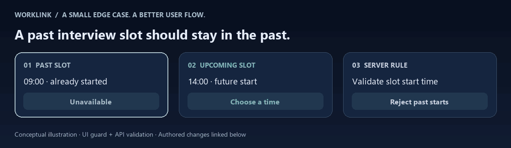
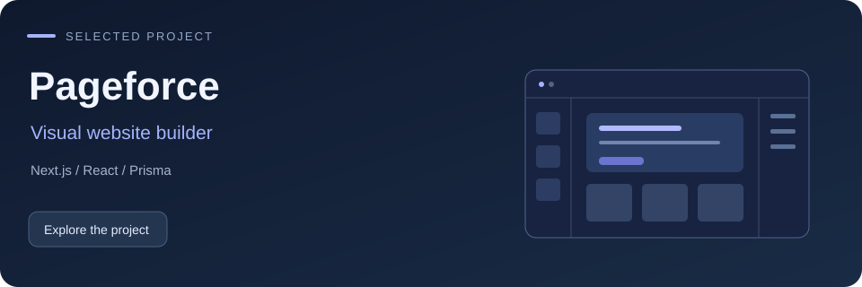
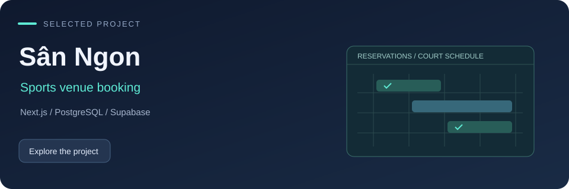

  <picture><source media="(prefers-reduced-motion: reduce)" srcset="./assets/profile-banner.png" /></picture>

  
  
  

I’m Minh, a <strong>full-stack developer</strong> building practical products with React, TypeScript, NestJS, and PostgreSQL. I like the details that make a product work: a clear interface, explicit business rules, and a backend that backs them up.

<strong>A quick look at my work:</strong> <a href="https://worklink.id.vn">Try WorkLink ↗</a> · <a href="./docs/worklink-scheduling-story.md">Read an authored engineering story ↗</a> · <a href="https://github.com/MinhTT2?tab=repositories">Explore the code ↗</a>

<h2>01 / WorkLink — flagship team project</h2>

<strong>AI-powered job matching for the Vietnamese labor market.</strong> Software Engineering Project · Group 31 · React + NestJS

Job discovery, applications, interview scheduling, chat, and payment workflows in one platform. Semantic embeddings and vector search connect candidates with relevant opportunities.

  <a href="https://github.com/minhtt22-26/sepbe_G31/actions/workflows/ci.yml">Backend </a> ·
  <a href="https://github.com/he170794kieudinhdoan-lang/sepfe_G31/actions/workflows/ci.yml">Frontend </a>

<h3>One detail I cared about</h3>

A candidate opens an interview invitation after a slot has already started. The UI should explain why it is unavailable, and the API should enforce the same rule.

<picture><source media="(prefers-reduced-motion: reduce)" srcset="./assets/worklink-scheduling.png" /></picture>

<strong>My change:</strong> visible past-slot states, disabled selection, and a backend check on slot changes. I also refined invitation queries to consider upcoming slots and active deadlines.

<a href="./docs/worklink-scheduling-story.md"><strong>Read the engineering story →</strong></a> Problem · decision · code evidence · tradeoffs

<h3>What I contributed</h3>
<ul>
  <li><strong>Scheduling reliability:</strong> disabled past interview slots in the UI, rejected past-slot changes in the API, and refined pending invitation counts. <a href="https://github.com/minhtt22-26/sepbe_G31/commit/6633809ebe5b796e57cad1176b079bf7099449dc">API change ↗</a> · <a href="https://github.com/he170794kieudinhdoan-lang/sepfe_G31/commit/ef767e28c864400e0bc177c9fcb636f97ee78a24">UI change ↗</a></li>
  <li><strong>Responsive conversations:</strong> added a Socket.io hook and typing indicator. <a href="https://github.com/he170794kieudinhdoan-lang/sepfe_G31/commit/118863374b62e5c59fa3ef9f0a3bfebafac790a8">Chat change ↗</a></li>
  <li><strong>Quality and delivery:</strong> expanded backend tests, added frontend CI/CD, and handled render failures with an error boundary. Evidence below.</li>
</ul>

<a href="https://worklink.id.vn">Live website ↗</a> · <a href="https://github.com/minhtt22-26/sepbe_G31">Backend ↗</a> · <a href="https://github.com/he170794kieudinhdoan-lang/sepfe_G31">Frontend ↗</a>

Built with the G31 team. My contributions span <a href="https://github.com/MinhTT2">MinhTT2</a> and my earlier account <a href="https://github.com/minhtt22-26">minhtt22-26</a>.

  
<strong>Engineering details &amp; verified contribution links</strong>

<picture><source media="(prefers-reduced-motion: reduce)" srcset="./assets/worklink-flow.png" /></picture>

<table>
  <tr><th align="left">Product capability</th><th align="left">Engineering behind it</th></tr>
  <tr><td>Semantic recommendations</td><td>Gemini embeddings, PostgreSQL/pgvector, and configurable scoring</td></tr>
  <tr><td>Application &amp; interview flows</td><td>React, TanStack Query, validated forms, and calendar interfaces</td></tr>
  <tr><td>Background processing</td><td>NestJS, Bull/Redis queues, retry handling, and scheduled tasks</td></tr>
  <tr><td>Chat &amp; payment workflows</td><td>Socket.io messaging, SePay checkout, and asynchronous webhook processing</td></tr>
</table>
<h3>My WorkLink contribution highlights</h3>

Selected changes I authored across my two accounts:

<table>
  <tr><th align="left">Area</th><th align="left">My contribution</th><th align="left">See the change</th></tr>
  <tr><td>Interview scheduling</td><td>Aligned past-slot handling across the UI and API; refined upcoming-slot and pending-invitation rules.</td><td><a href="https://github.com/minhtt22-26/sepbe_G31/commit/6633809ebe5b796e57cad1176b079bf7099449dc">API</a> · <a href="https://github.com/he170794kieudinhdoan-lang/sepfe_G31/commit/ef767e28c864400e0bc177c9fcb636f97ee78a24">UI</a></td></tr>
  <tr><td>Real-time chat</td><td>Added a Socket.io hook and typing indicator to make conversations feel responsive.</td><td><a href="https://github.com/he170794kieudinhdoan-lang/sepfe_G31/commit/118863374b62e5c59fa3ef9f0a3bfebafac790a8">Commit</a></td></tr>
  <tr><td>Backend quality</td><td>Expanded tests for services, DTOs, and infrastructure, including the Redis provider.</td><td><a href="https://github.com/minhtt22-26/sepbe_G31/commit/5f4b7b33d56f4e2c6830734c4ecf4a7945632802">Tests</a></td></tr>
  <tr><td>Delivery &amp; resilience</td><td>Added frontend CI/CD workflows and a top-level error boundary for render failures.</td><td><a href="https://github.com/he170794kieudinhdoan-lang/sepfe_G31/commit/37c7d5d557651701d0e884b47cc31362bfb7d6ae">CI/CD</a> · <a href="https://github.com/he170794kieudinhdoan-lang/sepfe_G31/commit/df882f9dac90df6eff1952b388bac86cf7af59c0">Error boundary</a></td></tr>
</table>

  
<strong>View my WorkLink contribution history</strong>

  <ul>
    <li>Backend: <a href="https://github.com/minhtt22-26/sepbe_G31/commits/main/?author=minhtt22-26">earlier account</a> · <a href="https://github.com/minhtt22-26/sepbe_G31/commits/main/?author=MinhTT2">current account</a></li>
    <li>Frontend: <a href="https://github.com/he170794kieudinhdoan-lang/sepfe_G31/commits/main/?author=minhtt22-26">earlier account</a> · <a href="https://github.com/he170794kieudinhdoan-lang/sepfe_G31/commits/main/?author=MinhTT2">current account</a></li>
  </ul>

<h2>02 / More products I’m building</h2>
<table>
  <tr>
    <td width="50%" valign="top">
      
      
Drag-and-drop editing with typed JSON blocks and a renderer shared by previews and public pages.

      
Ownership checks · Lead capture · Migrations · Tests

      
<a href="https://pageforce.vercel.app">Demo ↗</a> · <a href="https://github.com/MinhTT2/pageforce">Code ↗</a> · <a href="https://github.com/MinhTT2/pageforce/blob/main/docs/showcase.md">Tour ↗</a>

    </td>
    <td width="50%" valign="top">
      
      
Court discovery and booking with database-backed reservation rules and payment status updates.

      
Overlap protection · Expiring holds · Payment webhooks

      
<a href="https://san-ngon.vercel.app">Demo ↗</a> · <a href="https://github.com/MinhTT2/san-ngon">Code ↗</a> · <a href="https://github.com/MinhTT2/san-ngon#những-quyết-định-kỹ-thuật-chính">Decisions ↗</a>

    </td>
  </tr>
</table>

  
<strong>Inside Pageforce — the builder workflow</strong>

   
  
  
The editor and public pages share a renderer, keeping what you edit aligned with what visitors see.

  
<strong>Five-minute technical tour — where to start in the code</strong>

  <ul>
    <li><strong>WorkLink:</strong> inspect <a href="https://github.com/minhtt22-26/sepbe_G31/blob/main/src/modules/ai-matching/service/ai-matching.service.ts">matching orchestration</a>, <a href="https://github.com/minhtt22-26/sepbe_G31/blob/main/src/modules/ai-matching/repositories/ai-matching.repository.ts">vector queries</a>, and the <a href="https://github.com/minhtt22-26/sepbe_G31/commit/6633809ebe5b796e57cad1176b079bf7099449dc">interview scheduling fix</a>.</li>
    <li><strong>Pageforce:</strong> inspect the <a href="https://github.com/MinhTT2/pageforce/blob/main/src/components/blocks/BlockRenderer.tsx">shared block renderer</a> used by editing previews and public pages, then follow the <a href="https://github.com/MinhTT2/pageforce/blob/main/docs/showcase.md">product walkthrough</a>.</li>
    <li><strong>Sân Ngon:</strong> inspect <a href="https://github.com/MinhTT2/san-ngon/blob/main/supabase/migrations/20260925000000_booking_holds.sql">booking hold logic</a>, then read the <a href="https://github.com/MinhTT2/san-ngon#những-quyết-định-kỹ-thuật-chính">engineering decisions</a> behind reservations and payments.</li>
  </ul>

<h2>03 / How I build</h2>

<strong>Start with the user flow.</strong> Model the data and edge cases, validate changes at the right boundary, and make decisions easy to review.

  
<strong>Technology toolbox</strong>

<table>
  <tr><th align="left">Area</th><th align="left">Tools</th></tr>
  <tr><td>Frontend</td><td>React, Next.js, TypeScript, Vite, Tailwind CSS, TanStack Query</td></tr>
  <tr><td>Backend &amp; async work</td><td>NestJS, REST APIs, Redis, Bull, Socket.io</td></tr>
  <tr><td>Data &amp; AI integration</td><td>PostgreSQL, pgvector, Prisma, Supabase, Gemini embeddings</td></tr>
  <tr><td>Quality &amp; delivery</td><td>Jest, Vitest, Playwright, ESLint, GitHub Actions, Docker, Vercel</td></tr>
  <tr><td>Also exploring</td><td><a href="https://github.com/MinhTT2/learning-vuejs">Vue 3, Vue Router, and Vite</a></td></tr>
</table>

Some professional contributions live in private repositories. My public work shows the product flows and engineering decisions I can share.

