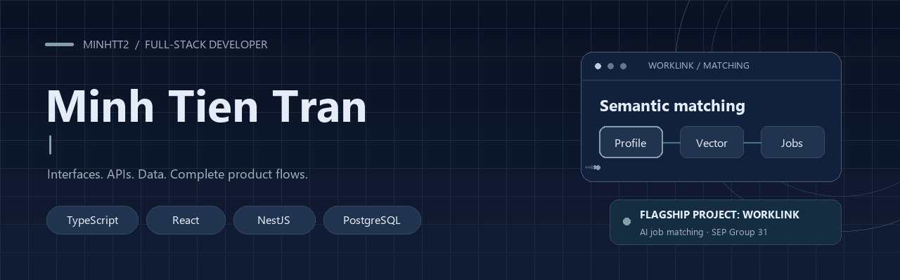
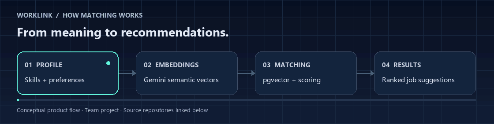
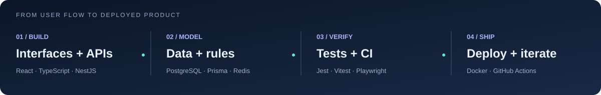

  <picture>
    <source media="(prefers-reduced-motion: reduce)" srcset="./assets/profile-banner.png" />
    
  </picture>

  <a href="https://worklink.id.vn">WorkLink</a> ·
  <a href="https://github.com/MinhTT2/pageforce">Pageforce</a> ·
  <a href="https://github.com/MinhTT2/san-ngon">Sân Ngon</a> ·
  <a href="https://github.com/MinhTT2?tab=repositories">Explore my work</a>

<h2>Hi, I'm Minh.</h2>

I build full-stack web applications, connecting <strong>React interfaces, TypeScript APIs, and PostgreSQL data</strong> into complete product workflows.

My flagship team project is <strong>WorkLink</strong>, an AI-powered job matching platform. My other projects explore visual website building and sports venue booking. I care about clear interfaces, explicit access rules, reliable data flows, and code that other developers can review.

<h2>Flagship project — WorkLink</h2>

  <a href="https://github.com/minhtt22-26/sepbe_G31/actions/workflows/ci.yml">Backend CI </a> ·
  <a href="https://github.com/he170794kieudinhdoan-lang/sepfe_G31/actions/workflows/ci.yml">Frontend CI </a>

<strong>AI-powered job matching for the Vietnamese labor market.</strong> Team project · Software Engineering Project · Group 31

WorkLink brings job discovery, candidate and employer profiles, applications, interview scheduling, chat, and payment workflows into one platform. Its matching pipeline uses semantic embeddings and vector similarity to rank relevant jobs and candidates.

<picture><source media="(prefers-reduced-motion: reduce)" srcset="./assets/worklink-flow.png" /></picture>

<table>
  <tr><th align="left">Product capability</th><th align="left">Engineering behind it</th></tr>
  <tr><td>Semantic recommendations</td><td>Gemini embeddings, PostgreSQL/pgvector, and configurable scoring</td></tr>
  <tr><td>Application &amp; interview flows</td><td>React, TanStack Query, validated forms, and calendar interfaces</td></tr>
  <tr><td>Background processing</td><td>NestJS, Bull/Redis queues, retry handling, and scheduled tasks</td></tr>
  <tr><td>Chat &amp; payment workflows</td><td>Socket.io messaging, SePay checkout, and asynchronous webhook processing</td></tr>
</table>

<strong>React · Vite · TypeScript · NestJS · Prisma · PostgreSQL/pgvector · Redis · Gemini</strong>

<a href="https://worklink.id.vn">Visit WorkLink ↗</a> · <a href="https://github.com/minhtt22-26/sepbe_G31">Backend source ↗</a> · <a href="https://github.com/he170794kieudinhdoan-lang/sepfe_G31">Frontend source ↗</a>

I contributed to both repositories through <a href="https://github.com/MinhTT2">MinhTT2</a> and my earlier account <a href="https://github.com/minhtt22-26">minhtt22-26</a>. WorkLink was built with the G31 team.

<h3>My WorkLink contribution highlights</h3>

Selected changes I authored across my two accounts:

<table>
  <tr><th align="left">Area</th><th align="left">My contribution</th><th align="left">See the change</th></tr>
  <tr><td>Interview scheduling</td><td>Handled race conditions and edge cases in the backend, and improved scheduling interactions in the frontend.</td><td><a href="https://github.com/minhtt22-26/sepbe_G31/commit/6633809ebe5b796e57cad1176b079bf7099449dc">API</a> · <a href="https://github.com/he170794kieudinhdoan-lang/sepfe_G31/commit/ef767e28c864400e0bc177c9fcb636f97ee78a24">UI</a></td></tr>
  <tr><td>Real-time chat</td><td>Added a Socket.io hook and typing indicator to make conversations feel responsive.</td><td><a href="https://github.com/he170794kieudinhdoan-lang/sepfe_G31/commit/118863374b62e5c59fa3ef9f0a3bfebafac790a8">Commit</a></td></tr>
  <tr><td>Backend quality</td><td>Expanded tests for services, DTOs, and infrastructure, including the Redis provider.</td><td><a href="https://github.com/minhtt22-26/sepbe_G31/commit/5f4b7b33d56f4e2c6830734c4ecf4a7945632802">Tests</a></td></tr>
  <tr><td>Delivery &amp; resilience</td><td>Added frontend CI/CD workflows and a top-level error boundary for render failures.</td><td><a href="https://github.com/he170794kieudinhdoan-lang/sepfe_G31/commit/37c7d5d557651701d0e884b47cc31362bfb7d6ae">CI/CD</a> · <a href="https://github.com/he170794kieudinhdoan-lang/sepfe_G31/commit/df882f9dac90df6eff1952b388bac86cf7af59c0">Error boundary</a></td></tr>
</table>

  
<strong>View my WorkLink contribution history</strong>

  <ul>
    <li>Backend: <a href="https://github.com/minhtt22-26/sepbe_G31/commits/main/?author=minhtt22-26">earlier account</a> · <a href="https://github.com/minhtt22-26/sepbe_G31/commits/main/?author=MinhTT2">current account</a></li>
    <li>Frontend: <a href="https://github.com/he170794kieudinhdoan-lang/sepfe_G31/commits/main/?author=minhtt22-26">earlier account</a> · <a href="https://github.com/he170794kieudinhdoan-lang/sepfe_G31/commits/main/?author=MinhTT2">current account</a></li>
  </ul>

<h2>More selected work</h2>
<table>
  <tr>
    <td width="50%" valign="top">
      <h3><a href="https://github.com/MinhTT2/pageforce">Pageforce</a></h3>
      
<strong>A visual website builder with a shared rendering system.</strong>

      
Build multipage marketing sites through a drag-and-drop editor. Typed JSON blocks connect editing, validation, preview, and public rendering.

      <ul>
        <li>Site ownership, authentication, uploads, and lead capture.</li>
        <li>Prisma migrations, Vitest tests, Playwright smoke tests, and CI configuration.</li>
      </ul>
      
Next.js · React · TypeScript · Supabase · Prisma

      
<a href="https://pageforce.vercel.app">Live demo ↗</a> · <a href="https://github.com/MinhTT2/pageforce">Source ↗</a> · <a href="https://github.com/MinhTT2/pageforce/blob/main/docs/showcase.md">Project tour ↗</a>

    </td>
    <td width="50%" valign="top">
      <h3><a href="https://github.com/MinhTT2/san-ngon">Sân Ngon</a></h3>
      
<strong>A sports venue booking MVP with payment workflows.</strong>

      
Find available courts, reserve a time slot, and follow payment status. Owners manage venues, schedules, pricing, and bookings.

      <ul>
        <li>PostgreSQL constraints prevent overlapping reservations.</li>
        <li>Server-side pricing, expiring holds, and duplicate-safe payment webhooks.</li>
      </ul>
      
Next.js · React · TypeScript · PostgreSQL · Supabase · SePay

      
<a href="https://san-ngon.vercel.app">Live demo ↗</a> · <a href="https://github.com/MinhTT2/san-ngon">Source ↗</a> · <a href="https://github.com/MinhTT2/san-ngon#những-quyết-định-kỹ-thuật-chính">Engineering decisions ↗</a>

    </td>
  </tr>
</table>

  
<strong>Inside Pageforce — the builder workflow</strong>

   
  
  
The editor and public pages share a renderer, keeping what you edit aligned with what visitors see.

  
<strong>Five-minute technical tour — where to start in the code</strong>

  <ul>
    <li><strong>WorkLink:</strong> inspect <a href="https://github.com/minhtt22-26/sepbe_G31/blob/main/src/modules/ai-matching/service/ai-matching.service.ts">matching orchestration</a>, <a href="https://github.com/minhtt22-26/sepbe_G31/blob/main/src/modules/ai-matching/repositories/ai-matching.repository.ts">vector queries</a>, and the <a href="https://github.com/minhtt22-26/sepbe_G31/commit/6633809ebe5b796e57cad1176b079bf7099449dc">interview scheduling fix</a>.</li>
    <li><strong>Pageforce:</strong> inspect the <a href="https://github.com/MinhTT2/pageforce/blob/main/src/components/blocks/BlockRenderer.tsx">shared block renderer</a> used by editing previews and public pages, then follow the <a href="https://github.com/MinhTT2/pageforce/blob/main/docs/showcase.md">product walkthrough</a>.</li>
    <li><strong>Sân Ngon:</strong> inspect <a href="https://github.com/MinhTT2/san-ngon/blob/main/supabase/migrations/20260925000000_booking_holds.sql">booking hold logic</a>, then read the <a href="https://github.com/MinhTT2/san-ngon#những-quyết-định-kỹ-thuật-chính">engineering decisions</a> behind reservations and payments.</li>
  </ul>

<h2>Tools I use in my projects</h2>
<table>
  <tr><th align="left">Area</th><th align="left">Tools</th></tr>
  <tr><td>Frontend</td><td>React, Next.js, TypeScript, Vite, Tailwind CSS, TanStack Query</td></tr>
  <tr><td>Backend &amp; async work</td><td>NestJS, REST APIs, Redis, Bull, Socket.io</td></tr>
  <tr><td>Data &amp; AI integration</td><td>PostgreSQL, pgvector, Prisma, Supabase, Gemini embeddings</td></tr>
  <tr><td>Quality &amp; delivery</td><td>Jest, Vitest, Playwright, ESLint, GitHub Actions, Docker, Vercel</td></tr>
  <tr><td>Also exploring</td><td><a href="https://github.com/MinhTT2/learning-vuejs">Vue 3, Vue Router, and Vite</a></td></tr>
</table>

<h2>How I approach a feature</h2>

<ul>
  <li><strong>Start with the user flow.</strong> Connect the interface, data model, and edge cases.</li>
  <li><strong>Keep boundaries explicit.</strong> Validate input and enforce ownership and business rules where data changes.</li>
  <li><strong>Make the work reviewable.</strong> Document decisions and use automated checks appropriate to the project.</li>
</ul>

Some professional contributions live in private repositories. My public projects show the product flows and engineering decisions I can share.

