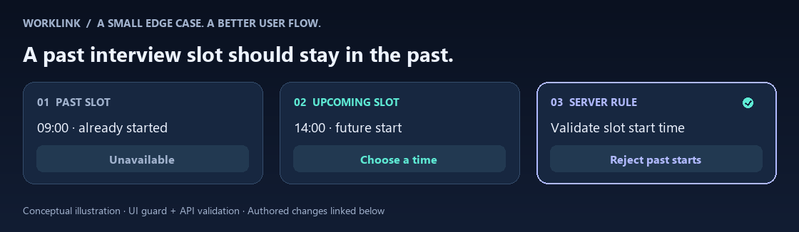

# WorkLink: making interview slot selection clearer

**An authored full-stack change by Minh Tien Tran · SEP Group 31 team project.**

[Profile](https://github.com/MinhTT2) · [WorkLink](https://worklink.id.vn) · [Backend change](https://github.com/minhtt22-26/sepbe_G31/commit/6633809ebe5b796e57cad1176b079bf7099449dc) · [Frontend change](https://github.com/he170794kieudinhdoan-lang/sepfe_G31/commit/ef767e28c864400e0bc177c9fcb636f97ee78a24)

## The situation

An interview invitation can contain several time slots. By the time a candidate opens it, one or more slots may already have started. The candidate needs an understandable state; the backend needs its own validation for requests made from an older page or outside the UI.

Example: a 09:00 slot is in the past while a 14:00 slot is still upcoming. The candidate should see the past slot as unavailable and be able to explore the future option, subject to the invitation's other rules.

## What I changed

| Boundary | Change in the public diff | Purpose |
|---|---|---|
| Slot UI | Compute `isPast` from the slot start; disable selection and show “Đã qua” with explanatory text. | Make the unavailable state visible before submission. |
| Invitation UI | Check `allSlotsPast` in the choose/change condition. | Avoid offering a choice when every slot has started. |
| Slot-change API | Reject a slot when its start is at or before the server's current time. | Enforce the past-slot rule independently of the UI. |
| Deadline validation | Select reference slots whose end (or start fallback) is still future, then find their earliest start; apply the related deadline check when that future set exists. | Refine which slots influence deadline validation. |
| Pending counts | Require a campaign slot with a future start, plus an invitation deadline that is future or absent. | Filter expired or irrelevant pending invitations in this query. |

These changes were authored under my earlier GitHub account, **[minhtt22-26](https://github.com/minhtt22-26)**. WorkLink's wider matching, chat, and payment systems are team work.

## Why this needs both the interface and the API

A disabled button helps the candidate understand the rule. It cannot enforce the rule by itself: a page can become stale, and an API can receive a request without that interface. The slot-change endpoint therefore validates the start time too.

The frontend uses the browser's current time for display. The backend checks the server's time for its decision. Keeping both checks explicit makes that division visible in the code.

## A distinction worth discussing

The diff uses **end time** (with a start-time fallback) to identify future reference slots for deadline validation, but uses **start time** for UI selection and the slot-change guard. A slot already in progress can therefore belong to the reference set while being unavailable for a new selection. Those predicates answer different questions; they should not be described as identical rules.

The existing capacity check is separate. This patch does not by itself demonstrate an atomic reservation or a concurrency fix.

## Review the implementation

- [Backend diff](https://github.com/minhtt22-26/sepbe_G31/commit/6633809ebe5b796e57cad1176b079bf7099449dc): look for `interview-invitation.service.ts`, `futureSlots`, pending invitation filters, and the past-start rejection.
- [Frontend diff](https://github.com/he170794kieudinhdoan-lang/sepfe_G31/commit/ef767e28c864400e0bc177c9fcb636f97ee78a24): look for `WorkerInvitations.jsx`, `allSlotsPast`, and `isPast`.

## How I would verify this boundary

These are review scenarios, not claimed test results:

- A mix of past and future slots: past choices disabled, future choices subject to the usual invitation rules.
- Every slot past: choosing/changing a slot unavailable.
- Start time exactly equal to now: the backend rejects the slot change.
- A page left open across a slot's start: the backend still rejects the now-past selection.
- Expired and absent invitation deadlines: each follows the pending-query filter explicitly.
- A slot in progress: check the intended distinction between end-based reference selection and start-based booking eligibility.

For further hardening, I would examine clock differences, refresh behavior, timezone handling, and atomic capacity enforcement with the team.

*This write-up is based on the linked public changes. It does not claim measured business impact, production performance, or an independently executed test run.*
